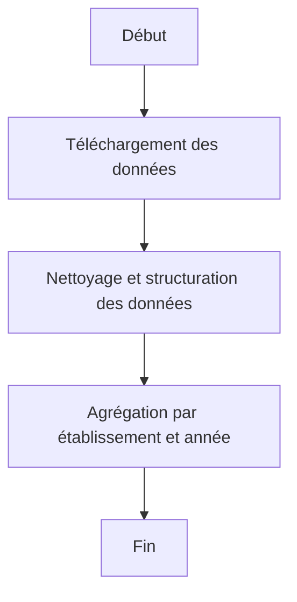

# Cahier des Charges – Projet **Edu Data**

## Objectif du projet :

Développer une application web interactive permettant de visualiser, analyser et explorer les choix de spécialités effectués par les élèves de première (et éventuellement de terminale) dans les lycées généraux de France. L'application reposera sur des jeux de données publics fournis par l'État.

---

## Sources de données

Les données seront récupérées à partir des jeux de données officiels disponibles sur [data.gouv.fr] :

- **Données pour l'effectif total de chaque lycée** :  
  [Effectif total de chaque lycée](https://www.data.gouv.fr/fr/datasets/effectifs-dans-les-enseignements-de-specialites-en-1ere-generale-par-specialites-et-selon-les-principales-triplettes/)

- **Données pour la localisation précise de chaque lycée** :  
  [Données de localisations](https://www.data.gouv.fr/fr/datasets/effectifs-dans-les-enseignements-de-specialites-en-1ere-generale-par-specialites-et-selon-les-principales-triplettes/)

- **Données pour les élèves de première** :  
  [Effectifs dans les enseignements de spécialités en 1ère générale](https://www.data.gouv.fr/fr/datasets/effectifs-dans-les-enseignements-de-specialites-en-1ere-generale-par-specialites-et-selon-les-principales-triplettes/)

- **Données pour les élèves de terminale** :  
  [Effectifs dans les enseignements de spécialités en terminale générale](https://www.data.gouv.fr/fr/datasets/effectifs-dans-les-enseignements-de-specialites-en-terminale-generale-par-specialites-et-selon-les-principales-doublettes/)

---

## Fonctionnalités attendues

### 1. Importation et traitement des données

- Télécharger et traiter les jeux de données (format CSV ou autre) fournis sur data.gouv.fr.
- Nettoyer et structurer les données pour les rendre exploitables.
- Agréger les informations par établissement, année scolaire, spécialités, genre et effectifs.

---

### 2. Carte interactive de France

- Afficher une **carte interactive** de la France avec tous les **lycées généraux & technologique** proposant des spécialités.
- Chaque lycée sera représenté par un **"pin" ou point interactif**.
- La position géographique des établissements sera déterminée à partir des données disponibles ou d'une API de géocodage (si nécessaire).

---

### 3. Fiche établissement (popup au clic)

Lorsqu’un utilisateur clique sur un lycée sur la carte, une **fiche récapitulative** doit s’afficher avec les informations suivantes :

- **Nom complet de l’établissement**
- **Filières proposées** (générale uniquement ou autres si disponibles)
- **Académie** d’appartenance
- **Département** d’implantation
- **Spécialités Proposées** 
---

### 4. Statistiques détaillées par niveau (1ère ou Terminale)

Après sélection du **niveau souhaitée** (Première ou Terminale), les statistiques suivantes doivent apparaître :

#### a. Effectifs généraux

- **Effectif total** pour chaque année scolaire disponible
- **Évolution de l’effectif total** d’une année sur l’autre

#### b. Répartition par genre

- **Effectif total de filles** + courbe d’évolution
- **Effectif total de garçons** + courbe d’évolution

#### c. Choix des spécialités

- Liste des spécialités proposées dans l’établissement pour le niveau sélectionné
- **Visualisation graphique** des spécialités choisies :
  - Représentation via un **camembert**, **barres**, ou **histogramme** (au choix)
  - Pour chaque spécialité :
    - Nom
    - Nombre total d’élèves inscrits dans la spécialité :
      - Nombre total de fille dans la spécialité
      - Nombre total de graçon dans la spécialité
---

## Fonctionnalités supplémentaires possibles (optionnel)

- **Filtrage par académie ou département**
- **Recherche par nom d’établissement**
- **Recherche par spécialité**

---

## Interface utilisateur (UI)

- Interface simple, intuitive et responsive (adaptée aux écrans mobiles et PC)
- Couleurs sobres, typographie claire
- Composants dynamiques (carte, graphiques, boutons de sélection…)

---

## Technologies envisagées (à titre indicatif)

- **Frontend** : HTML5, CSS3, JavaScript (framework type React ou Vue)
- **Cartographie** : Fond de carte libre de droit et éditable en Python
- **Backend (si nécessaire)** : Python
- **Hébergement** : GitHub Pages

---

## Contraintes

- Respect des données personnelles : aucune donnée nominative ne sera traitée
- Le site doit être léger et accessible
- Respect des licences d’utilisation des données publiques (Licence Ouverte)

---

## Planning prévisionnel

| Étape                             | Fait |
|----------------------------------|-|
| Récupération et traitement des données | |
| Développement de la carte interactive | |
| Implémentation des fiches et graphiques |  |
| Tests et corrections              |  |
| Mise en ligne                    |  |

---
## Annexe - Diagrammes structurels

### 1. Organisation des tâches

